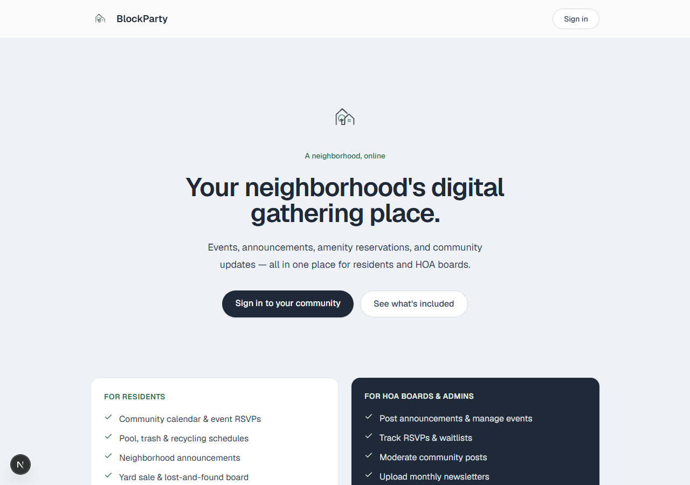
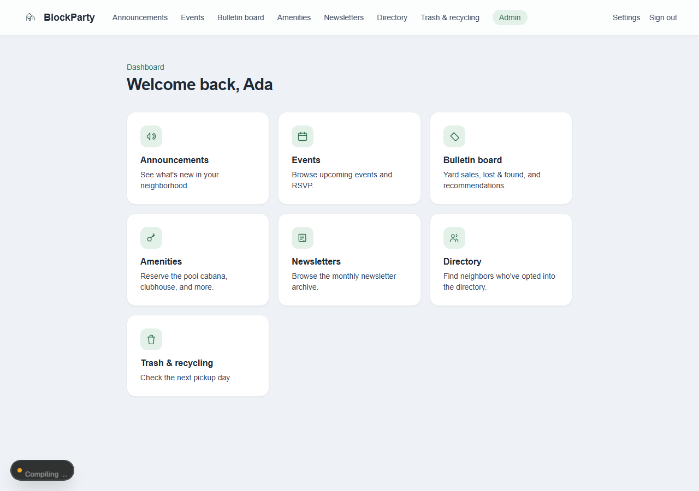
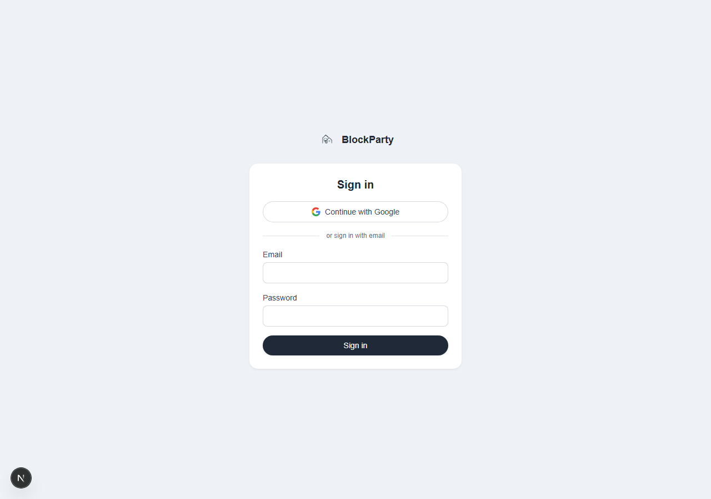
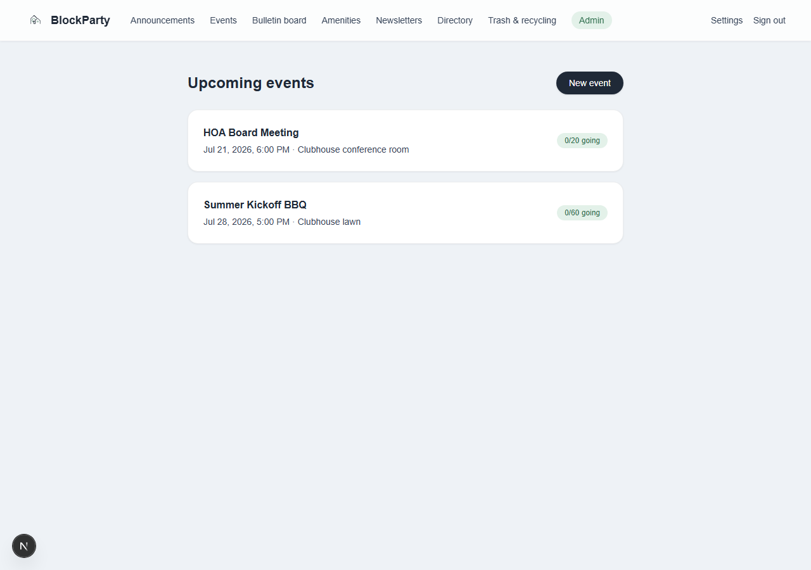

# BlockParty

A neighborhood/HOA community platform, built to go past CRUD-tutorial
territory into the parts of real SaaS that are actually hard: multi-tenant
data isolation, role-based access enforced at more than one layer, a
hybrid credentials + OAuth sign-in flow with a real onboarding handoff, and
business logic with genuine edge cases — waitlists, booking conflicts,
recurring schedules.

**Live demo:** [blockparty-zeta.vercel.app](https://blockparty-zeta.vercel.app)

| Role | Email | Password |
|---|---|---|
| Owner | `owner@blockparty.test` | `password123` |
| Admin | `admin@maplegrove.test` | `password123` |
| Resident | `resident@maplegrove.test` | `password123` |

Residents can also sign in with Google — see [Sign-in model](#sign-in-model).
The owner demo account is a regular seeded credentials login like the
other two — the *real* owner (tied to the deployer's own Google account
via `OWNER_EMAIL`) is a separate, non-demoable account with the same role.



## What it does

Events with capacity-aware RSVPs, neighborhood announcements, a bulletin
board (yard sales, lost & found, recommendations), amenity reservations,
a newsletter archive, an opt-in resident directory, and trash/recycling
pickup schedules — all scoped to a neighborhood and gated by role
(`resident` / `board` / `admin`). Above that, a platform-level `owner`
provisions new neighborhoods and HOA admin accounts from its own
dashboard — the same shape as how most multi-tenant SaaS onboards new
customers.



## Notable engineering decisions

A few things here were built the harder-but-more-realistic way on purpose:

- **Multi-tenancy.** Every domain table (`events`, `announcements`, `posts`,
  `amenities`, `reservations`, `newsletters`, `waste_schedules`) carries a
  `neighborhoodId`, and every query filters by the signed-in user's
  neighborhood — see `src/db/schema.ts`. Nothing assumes a single tenant.
- **Hybrid auth with real account linking.** Board/admin accounts sign in
  with credentials; residents sign in with Google. A first-time Google
  sign-in with no matching account doesn't get auto-enrolled — it's routed
  to an onboarding step to pick a neighborhood, at which point a resident
  account is created and, since there's no database-session adapter, the
  *live* JWT is refreshed in place via `unstable_update()`. See
  `src/auth.ts` and `src/app/onboarding/page.tsx`.
- **Defense in depth on authorization.** Role checks happen at the edge
  (`src/proxy.ts`, the current Next.js middleware convention) *and* again
  inside every Server Action that mutates board-only data
  (`requireBoard()` in `src/lib/session.ts`) — a bypassed redirect doesn't
  mean a mutation gets through.
- **Business logic with actual edge cases**, not just CRUD:
  - Event RSVPs respect capacity; cancelling automatically promotes the
    earliest waitlisted registrant (`src/app/dashboard/events/[id]/page.tsx`).
  - Amenity reservations reject overlapping time slots — a real
    interval-overlap check, not just "is this exact slot taken"
    (`src/app/dashboard/amenities/[id]/page.tsx`).
  - Recurring trash/recycling pickups compute the *next* date from a
    day-of-week + weekly/biweekly frequency + anchor date. `src/lib/waste.ts`
    is a small pure function, checked against a real calendar (Jul 17 → Jul
    31 → Aug 14 for a biweekly Friday pickup).
- **Real infrastructure, not mocks.** Neon serverless Postgres (via Drizzle
  ORM) and Vercel Blob, provisioned through the Vercel Marketplace and
  wired up with environment variables scoped separately across
  Production/Preview/Development — not just a local SQLite file.
- **A platform tier above the tenants.** A fourth role, `owner`, sits above
  `resident`/`board`/`admin` and isn't scoped to any neighborhood — it's
  auto-provisioned for one specific email (`OWNER_EMAIL`) on Google
  sign-in. From `/dashboard/owner` it gets full CRUD on neighborhoods and
  HOA admin accounts — including a guardrail that only allows deleting a
  neighborhood once it's actually empty, since the FK cascade otherwise
  takes every resident, admin, and their posts/events with it. This is the
  same shape as how most real multi-tenant SaaS onboards new customers/orgs.
- **Self-service tenant onboarding, with real email.** Anyone can request
  a neighborhood from the public homepage — no account needed. That's an
  unauthenticated write endpoint, so it's hardened accordingly: a honeypot
  field, per-email rate limiting, and server-side length validation. A
  Resend email notifies the owner the moment a request comes in
  (`replyTo` set to the requester, so replying works immediately); the
  owner reviews it from `/dashboard/owner/requests`, and approving
  auto-generates a password and emails the new admin their login link
  directly, while denying sends a polite decline. (Caught a real bug
  wiring this up: the Resend SDK returns `{ error }` for API-level
  rejections — sandbox mode blocking a send to anyone but the account's
  own email, in this case — rather than throwing, so a bare try/catch
  was silently swallowing failures. Also worth knowing if you fork this:
  without a verified domain, Resend's test mode only delivers to the
  account's own address — the owner-notification email is unaffected
  since that's always who it's sent to, but approve/deny emails to real
  requesters need a verified domain to reach anyone else.)

## Tech stack

| Layer | Choice |
|---|---|
| Framework | [Next.js](https://nextjs.org) 16 (App Router) + TypeScript + Tailwind CSS v4 |
| Database | [Neon](https://neon.tech) serverless Postgres + [Drizzle ORM](https://orm.drizzle.team) |
| Auth | [Auth.js v5](https://authjs.dev) — Credentials (admin/board) + Google OAuth (residents), JWT sessions |
| File storage | [Vercel Blob](https://vercel.com/docs/storage/vercel-blob) |
| Hosting | [Vercel](https://vercel.com) |

## Sign-in model

- **Owner** — one specific Google account (set via `OWNER_EMAIL`) is
  auto-provisioned/promoted to `owner` on sign-in. Not tied to any
  neighborhood; manages neighborhoods and HOA admin accounts from
  `/dashboard/owner`. (The seeded `owner@blockparty.test` demo account
  reaches the same dashboard via credentials — the role check doesn't
  care which provider got you there, only the `users.role` column.)
- **Admin/board** accounts are provisioned by the owner (via
  `/dashboard/owner/admins/new`, or the seed script for local dev) and sign
  in with email + password.
- **Residents** sign in with Google. The first time a Google account signs
  in with no matching `users` row, they land on `/onboarding` to pick their
  neighborhood from an interactive card picker before a resident account
  is created for them — see the `jwt`/`signIn` callbacks in `src/auth.ts`.

<table>
<tr>
<td></td>
<td></td>
</tr>
</table>

## Local setup

1. Install dependencies:

   ```bash
   npm install
   ```

2. Create a [Neon](https://console.neon.tech) project and copy its
   connection string into a `.env.local` file:

   ```bash
   cp .env.example .env.local
   ```

3. Push the schema and seed some sample data:

   ```bash
   npm run db:push
   npm run db:seed
   ```

4. Run the dev server:

   ```bash
   npm run dev
   ```

   Open [http://localhost:3000](http://localhost:3000). Sign in with the
   seeded accounts above.

## Database

Schema lives in `src/db/schema.ts`. Useful scripts:

- `npm run db:generate` — generate a SQL migration from schema changes
- `npm run db:push` — push the current schema straight to the database
  (fine for early development; switch to migrations once there's real data)
- `npm run db:studio` — browse data in Drizzle Studio

## Google OAuth setup

1. In [Google Cloud Console](https://console.cloud.google.com/apis/credentials),
   create an **OAuth client ID** (Application type: Web application).
2. Add authorized redirect URIs for each environment you use:
   - `http://localhost:3000/api/auth/callback/google`
   - `https://<your-production-domain>/api/auth/callback/google`
3. Copy the client ID/secret into `AUTH_GOOGLE_ID` / `AUTH_GOOGLE_SECRET`
   (`.env.local` for dev, Vercel project env vars for prod).
4. Set `OWNER_EMAIL` to whichever Google account should be the platform
   owner. While the app is in Google's "Testing" publishing status, only
   emails added as test users on the OAuth consent screen can sign in at
   all — add that owner email (and any resident test accounts) there.

## Deployment

- **App** → Vercel. Set `DATABASE_URL`, `AUTH_SECRET`,
  `BLOB_READ_WRITE_TOKEN`, `AUTH_GOOGLE_ID`, `AUTH_GOOGLE_SECRET`,
  `OWNER_EMAIL`, and `RESEND_API_KEY` as environment variables in the
  Vercel project settings.
- **Database** → Neon. Use a pooled connection string for serverless
  functions.
- **File storage** → create a Blob store under the Vercel project's
  Storage tab; it provisions `BLOB_READ_WRITE_TOKEN` automatically. Run
  `vercel env pull` to get it locally.
- **Email** → [Resend](https://resend.com) (free tier): notifies the
  owner of new neighborhood requests, and emails a requester directly
  when the owner approves (login link + temp password) or denies theirs.
  Degrades gracefully if unset — the app logs a warning and moves on
  rather than failing the underlying action. Without a verified domain
  (resend.com/domains), Resend's test mode only delivers to the account's
  own email — see the note under Notable engineering decisions.

## What's next

Things I'd tackle if this kept growing past a portfolio piece:

- A "forgot password" flow for board/admin accounts (owner can still
  reset one manually from `/dashboard/owner/admins/[id]`, but there's no
  self-service reset yet)
- Automated tests — currently leans on `tsc`, `next build`, and
  scripted/manual browser verification for each change
- Full dark mode support (currently forced to light; see the comment in
  `src/app/globals.css` for why)
- Database migrations instead of `drizzle-kit push` once there's real user
  data to protect
